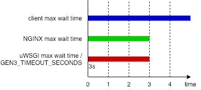

# cdispyutils

This package includes several utility Python tools for the Gen3 stack.


## profiling

See https://github.com/uc-cdis/cdis-python-utils/tree/master/cdispyutils/profiling


## uwsgi

This Flask extension module adds the ability to automatically set uWSGI HARAKIRI timeout
for each request based on request environment variable passed to uWSGI, which is usually
set in reverse proxy like NGINX. In order for HARAKIRI to take effect, uWSGI must run
with master process. There are two variables to control HARAKIRI:

* **GEN3_REQUEST_TIMESTAMP**

  This should be the actual UNIX timestamp when the request arrived reverse proxy. For
  NGINX this is usually `$msec`.
  
* **GEN3_TIMEOUT_SECONDS**

  This is a float value of seconds, uWSGI must not take time longer than that to handle
  this request.

Please note that the actual HARAKIRI timeout may be less than `GEN3_TIMEOUT_SECONDS`,
because:

1. uWSGI may not immediately start to process the request when it arrives uWSGI due to
   the lack of available worker process.

2. uWSGI only take integers as HARAKIRI timeout, therefore time less than 1 second is
   simply discarded (using `floor()` instead of `round()`).

That said, the reasonable minimum value of `GEN3_TIMEOUT_SECONDS` is `2`, because with
`1` the time left for uWSGI may usually happen to be slightly less than 1 second, which
gets truncated to zero; and this module would raise `504 Timed Out` error if the time is
zero or less, without even trying to handle the request.

Here's a visual demo for above model, assuming the client doesn't time out, and setting
both `uwsgi_read_timeout` and `GEN3_TIMEOUT_SECONDS` to `3`:



An example NGINX config looks like this:

```
    location / {
        ## GEN3_REQUEST_TIMESTAMP and GEN3_TIMEOUT_SECONDS
        # These two together aligns the HARAKIRI timeout in uWSGI with NGINX
        # See also https://github.com/uc-cdis/cdis-python-utils#uwsgi
        uwsgi_param GEN3_REQUEST_TIMESTAMP $msec;
        uwsgi_param GEN3_TIMEOUT_SECONDS '20';

        include uwsgi_params;
        uwsgi_pass unix:/var/www/service/uwsgi.sock;
        uwsgi_read_timeout 20s;
    }
```

(`uwsgi_read_timeout` is not necessarily the **whole** timeout of the request)

In your Flask application, install this extension:

```python
from cdispyutils.uwsgi import setup_user_harakiri

setup_user_harakiri(app)
```

A complex real use case is handling Kubernetes [readiness](https://kubernetes.io/docs/tasks/configure-pod-container/configure-liveness-readiness-probes/#define-readiness-probes)
queries. In sheepdog, uWSGI workers may all get blocked for quite a while, and Kubernetes
shall disconnect if the ping didn't return in 1 second (default). By default NGINX will
also disconnect its connection to uWSGI and end up with a 499 error in log. When uWSGI
finally got resource to handle this ping, it shall fail writing response to a broken
pipe. Kubernetes pings every 10 seconds, leading to lots of errors in both logs.

For this, we wrote NGINX conf like this:

```
    location /_status {
        uwsgi_param GEN3_REQUEST_TIMESTAMP $msec;
        uwsgi_param GEN3_TIMEOUT_SECONDS $arg_timeout;

        include uwsgi_params;
        uwsgi_pass unix:/var/www/service/uwsgi.sock;
        uwsgi_read_timeout 20s;
        uwsgi_ignore_client_abort on;
    }
```

And set Kubernetes with:

```
          livenessProbe:
            httpGet:
              path: /_status?timeout=20
              port: 80
            initialDelaySeconds: 30
            periodSeconds: 60
            timeoutSeconds: 30
          readinessProbe:
            httpGet:
              path: /_status?timeout=2
              port: 80
            periodSeconds: 10
            timeoutSeconds: 1
```

So that, while `liveness` pings work normally, `readiness` pings would not log errors
with delay of response up to 20 seconds (NGINX will keep waiting for uWSGI response if
`uwsgi_ignore_client_abort` is on even when client disconnects). Because we set HARAKIRI
timeout to 2 seconds, if the request stayed in uWSGI backlog for too much time, this
request will simply return 504 by this extension module, without touching the database.
