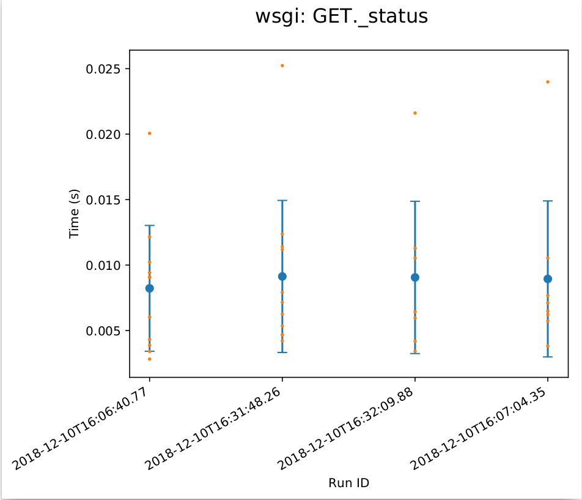

# Guide to `cdispyutils.profiling`

This module contains a few utilities for doing performance profiling on Python
code, from simple benchmarks to in-depth profiling information down the entire
call stack.

## Quick Introduction to Profiling in Python

Python comes with a few built-in utilities for profiling code. The
[library documentation](https://docs.python.org/2/library/profile.html) has more
detailed information about these. The key pieces are the `cProfile` and `pstats`
modules. `cProfile` allows for running some code under a profile which
aggregates execution frequencies and times for every call on the stack for the
code which it runs and saves the results to a file. `pstats` tabulates the
results from a `cProfile` file and allows for sorting and filtering based on
number of times executed, etc. The `Profiler` class here is a wrapper on top of
`cProfile` (and saves exactly these profiling files, so it works with any
standard things like `pstats`). These files can also be analyzed using other
visualization tools; I personally recommend
[snakeviz](https://jiffyclub.github.io/snakeviz/) as a tool which helps to
visualize the profiling results, as it is easy to install and simple to run.

## Usage

### Generating Profiling Results

The profiling module exports two tools to use for saving profiling results,
`Profiler` and `profile`. `Profiler` is intended to be used as a singleton
associated with a Flask app or similar, and called using `Profiler.call` on any
code which should be benchmarked. `profile` is a function decorator which saves
results for just the decorated function.

#### `cdispyutils.profiling.Profiler`

The `Profiler` by default will output the full results from `cProfile` into a
`.prof` file. However, it can also be set to only output execution times, which
eliminates overhead from running the profiler. The `Profiler` can be set for
simple output using the keyword argument `output_style="simple"`.
```python
profiler = Profiler(enable=True, output_style="detailed")
# profile a single function call
profiler.call("benchmark", my_complicated_function, args=args, kwargs=kwargs)
# profile all endpoints on a flask application
profiler.profile_app(app)
```

#### `cdispyutils.profiling.profile`

The decorator requires a category to output the results in as its first
argument, and otherwise just passes through all arguments to a `Profiler` which
it instantiates to handle the profiling for the individual function.
```python
@profile("benchmark")
def my_complicated_function(a, b, c):
    pass
```
The `profile` decorator will always create its own directory under `profile`
named with the timestamp of when it runs.

#### Output

The profiler class and decorator output results structured like this:
```
./profile/
├── <run>/
│   └── <category>/
│       ├── <function>-<count>.prof
│       ├── <function>-<count>.prof
│       └── <function>-<count>.prof
├── <run>/
│   ├── <category>/
│   │   └── ...
│   └── ...
└── ...
```

- `<run>` is by default a timestamp for when that profiler was initialized, and
  identifies this execution of the program (though it can be overridden in the
  `Profiler` initialization, allowing to output more files into a previous
  directory or just one with a specific name).
- `<category>` is the category provided by the user as the first argument to
  `Profiler.call` or the `profile` decorator, used to group together related
  function executions for the plots. If the profiler is set up with a Flask app
  using `profile_app` then it will output a `wsgi` category for those files.
- `<function>` is just the full module/function name
- `<count>` increments on each execution of the same function

### Visualizing Profiling Results

Also included here is the `cdispyutils.profiling.vis` module, which exports a
`ProfilePlotter` class to generate plots of the results generated by a
`Profiler`.
```python
from cdispyutils.profiling.vis import ProfilePlotter

plotter = ProfilePlotter("profile")
plotter.make_all_plots(save_file="profile_graphs.pdf")
```
This creates a file `profile_graphs` which contains a series of plots
displaying the execution times for the saved profile files. Any functions or
endpoints which were executed multiple times will accumulate all the results
into a single point for the average time, with error bars showing the standard
deviation across all executions, and individual calls during the same run shown
as smaller points overlaid on the average.

This example shows the output of the `ProfilePlotter` for the WSGI profiling
results on a status endpoint over four different runs of an application.


